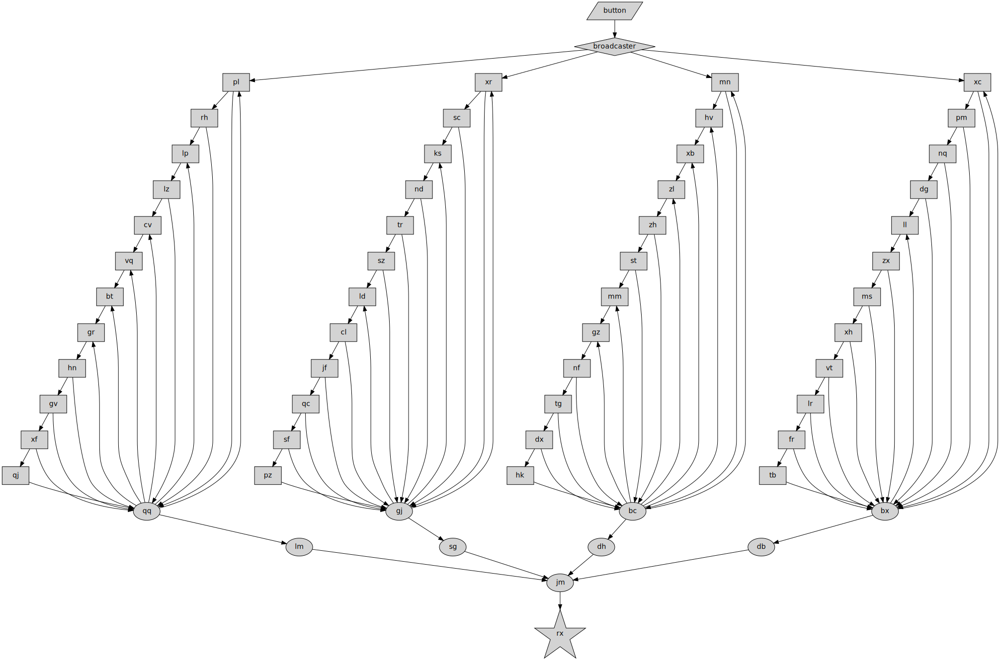

# 2023 Day 20: Pulse Propagation

With your help, the Elves manage to find the right parts and fix all of the machines. Now, they just need to send the command to boot up the machines and get the sand flowing again.

The machines are far apart and wired together with long _cables_. The cables don't connect to the machines directly, but rather to communication _modules_ attached to the machines that perform various initialization tasks and also act as communication relays.

## Part 1

Modules communicate using _pulses_. Each pulse is either a _high pulse_ or a _low pulse_. When a module sends a pulse, it sends that type of pulse to each module in its list of _destination modules_.

There are several different types of modules:

_Flip-flop_ modules (prefix `%`) are either _on_ or _off_; they are initially _off_. If a flip-flop module receives a high pulse, it is ignored and nothing happens. However, if a flip-flop module receives a low pulse, it _flips between on and off_. If it was off, it turns on and sends a high pulse. If it was on, it turns off and sends a low pulse.

_Conjunction_ modules (prefix `&`) _remember_ the type of the most recent pulse received from _each_ of their connected input modules; they initially default to remembering a _low pulse_ for each input. When a pulse is received, the conjunction module first updates its memory for that input. Then, if it remembers _high pulses_ for all inputs, it sends a _low pulse_; otherwise, it sends a _high pulse_.

There is a single _broadcast module_ (named `broadcaster`). When it receives a pulse, it sends the same pulse to all of its destination modules.

Here at Desert Machine Headquarters, there is a module with a single button on it called, aptly, the _button module_. When you push the button, a single _low pulse_ is sent directly to the `broadcaster` module.

After pushing the button, you must wait until all pulses have been delivered and fully handled before pushing it again. Never push the button if modules are still processing pulses.

Pulses are always processed _in the order they are sent_. So, if a pulse is sent to modules `a`, `b`, and `c`, and then module `a` processes its pulse and sends more pulses, the pulses sent to modules `b` and `c` would have to be handled first.

The module configuration (your puzzle input) lists each module. The name of the module is preceded by a symbol identifying its type, if any. The name is then followed by an arrow and a list of its destination modules. For example:

    broadcaster -> a, b, c
    %a -> b
    %b -> c
    %c -> inv
    &inv -> a
    

In this module configuration, the broadcaster has three destination modules named `a`, `b`, and `c`. Each of these modules is a flip-flop module (as indicated by the `%` prefix). `a` outputs to `b` which outputs to `c` which outputs to another module named `inv`. `inv` is a conjunction module (as indicated by the `&` prefix) which, because it has only one input, acts like an inverter (it sends the opposite of the pulse type it receives); it outputs to `a`.

By pushing the button once, the following pulses are sent:

    button -low-> broadcaster
    broadcaster -low-> a
    broadcaster -low-> b
    broadcaster -low-> c
    a -high-> b
    b -high-> c
    c -high-> inv
    inv -low-> a
    a -low-> b
    b -low-> c
    c -low-> inv
    inv -high-> a
    

After this sequence, the flip-flop modules all end up _off_, so pushing the button again repeats the same sequence.

Here's a more interesting example:

    broadcaster -> a
    %a -> inv, con
    &inv -> b
    %b -> con
    &con -> output
    

This module configuration includes the `broadcaster`, two flip-flops (named `a` and `b`), a single-input conjunction module (`inv`), a multi-input conjunction module (`con`), and an untyped module named `output` (for testing purposes). The multi-input conjunction module `con` watches the two flip-flop modules and, if they're both on, sends a _low pulse_ to the `output` module.

Here's what happens if you push the button once:

    button -low-> broadcaster
    broadcaster -low-> a
    a -high-> inv
    a -high-> con
    inv -low-> b
    con -high-> output
    b -high-> con
    con -low-> output
    

Both flip-flops turn on and a low pulse is sent to `output`! However, now that both flip-flops are on and `con` remembers a high pulse from each of its two inputs, pushing the button a second time does something different:

    button -low-> broadcaster
    broadcaster -low-> a
    a -low-> inv
    a -low-> con
    inv -high-> b
    con -high-> output
    

Flip-flop `a` turns off! Now, `con` remembers a low pulse from module `a`, and so it sends only a high pulse to `output`.

Push the button a third time:

    button -low-> broadcaster
    broadcaster -low-> a
    a -high-> inv
    a -high-> con
    inv -low-> b
    con -low-> output
    b -low-> con
    con -high-> output
    

This time, flip-flop `a` turns on, then flip-flop `b` turns off. However, before `b` can turn off, the pulse sent to `con` is handled first, so it _briefly remembers all high pulses_ for its inputs and sends a low pulse to `output`. After that, flip-flop `b` turns off, which causes `con` to update its state and send a high pulse to `output`.

Finally, with `a` on and `b` off, push the button a fourth time:

    button -low-> broadcaster
    broadcaster -low-> a
    a -low-> inv
    a -low-> con
    inv -high-> b
    con -high-> output
    

This completes the cycle: `a` turns off, causing `con` to remember only low pulses and restoring all modules to their original states.

To get the cables warmed up, the Elves have pushed the button `1000` times. How many pulses got sent as a result (including the pulses sent by the button itself)?

In the first example, the same thing happens every time the button is pushed: `8` low pulses and `4` high pulses are sent. So, after pushing the button `1000` times, `8000` low pulses and `4000` high pulses are sent. Multiplying these together gives _`32000000`_.

In the second example, after pushing the button `1000` times, `4250` low pulses and `2750` high pulses are sent. Multiplying these together gives _`11687500`_.

Consult your module configuration; determine the number of low pulses and high pulses that would be sent after pushing the button `1000` times, waiting for all pulses to be fully handled after each push of the button. _What do you get if you multiply the total number of low pulses sent by the total number of high pulses sent?_

Your puzzle answer was `841763884`.

## Part 2

The final machine responsible for moving the sand down to Island Island has a module attached named `rx`. The machine turns on when a _single low pulse_ is sent to `rx`.

Reset all modules to their default states. Waiting for all pulses to be fully handled after each button press, _what is the fewest number of button presses required to deliver a single low pulse to the module named `rx`?_

Your puzzle answer was `246006621493687`.

## Solution Notes

The puzzle description is quite elaborate and needs to be followed exactly, but apart from that, part 1 is quite simple.

Part 2, however, is a true complexity bomb. Brute force computation is out of the question, so the solution is really to reverse engineer the input and look what it does. In all reported cases from other users, the structure seems to be similar and the following observations can be made:
- The `broadcaster` node triggers four other nodes.
- The node that `rx` pulls from is a NAND gate ("conjunction") with four inputs.
  - Corollary: `rx` will only receive a low pulse if all of the four NAND inputs receive a high pulse.
- The paths between the four `broadcaster` outputs and pre-`rx` NAND inputs are disjoint and don't interact with each other.
- Each of the four subgraphs generates a period of N-1 low pulses followed by a single high pulse.
  - The period lengths are prime numbers.

With this knowledge (which has to be earned "the hard way"), the eventual solution is relatively straightforward: Let the simulation run until the periods for all four subgraphs are known (i.e. each subgraph has sent a high pulse to the final NAND gate), multiply the period lengths, and done.

But it's possible to do even better in terms of size and performance when exploiting the structure of the input. Visualized as a graph, it looks like this:

It's interesting to note (a) how simple the structure is, and (b) how the period lengths can be directly derived from the graph as binary numbers: A FF with a signal going out to the NAND is a `1`, a FF with only a signal coming _in_ from the NAND is a `0`. The MSB is the FF that doesn't output to anything but the NAND (i.e. the bottom in the graph), the LSB (which is connected to the NAND in both directions) is always `1`.

* Part 1, Python: 476 bytes, ~100 ms
* Part 2, Python (simulation): 515 bytes, ~350 ms
* Part 2, Python (input graph parsing): 326 bytes, <100 ms
