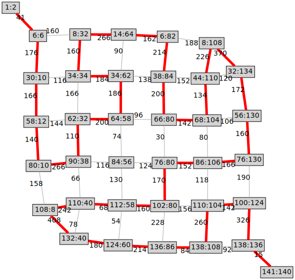

# [2023, Day 23: A Long Walk](https://adventofcode.com/2023/day/23)

## Solution Notes

A very interesting twist on the standard pathfinding algorithms &ndash; but unfortunately, the Longest Path Problem is NP-hard, and it shows.

Due to the direction constraints, part 1 is perfectly manageable with a simple DFS; the only optimization required is that recursion must only happen at actual junctions, otherwise Python's recursion limit will hit.

Running the same DFS directly for part 2 is futile; it *will* eventually terminate, but at least in Python, it's *far* too slow to be acceptable. The problem needs to be simplified first, and this can be done by observing that there is only a relatively low number of junctions in the maze, and the distances between each junction can be pre-computed. The start and goal positions count as junctions too, and thus the resulting distance matrix is a weighted undirected graph:

With this simplified representation, the final DFS becomes a little quicker: one minute instead of several hours. This is still too long to be _really_ practical, so I thought of another optimization: Instead of having an actual Python set of visited nodes, a bitfield of visited nodes is also possible. This can be constructed by mapping each junction / graph node to a power of two (which is easy, as there's only 36 nodes). This does indeed make things faster, but only by a factor of two. Python itself seems to be a limitation here, so I escalated one step further and made the Python code generate a small C program that contains the distance matrix in a long `switch`...`case` statement. With this, I get down to sub-second runtimes for everything from Python graph generation and C compilation to execution of the compiled program.

* Part 1, Python (direct maze DFS): 417 bytes, ~400 ms
* Part 2, Python (graph DFS using sets): 425 bytes, ~60 s
* Part 2, Python (graph DFS using bitfields): 503 bytes, ~35 s
* Part 2, Python (generating and running C code): 789 bytes, ~700 ms
